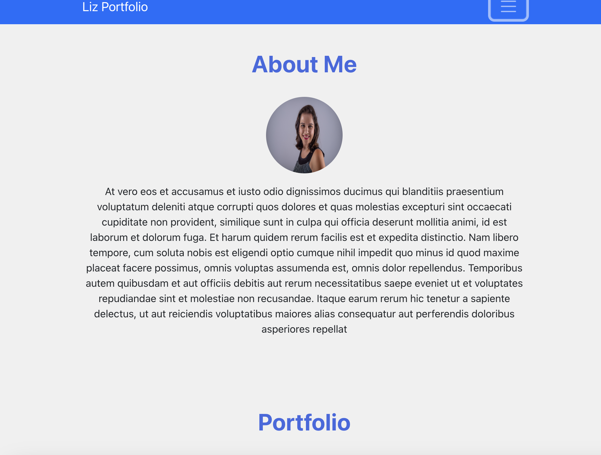

# Profile-Page

## Table of Contents

- [Description](#description)
- [installation](#installation)
- [Usage](#usage)
- [License](#license)
- [Contributing](#contributing)
- [Tests](#tests)
- [Questions](#questions)

## Description

This is a Portfolio app created with React.js. It contains an About page, Portfolio page, and Contact page. The portfolio

## Installation

contains three projects, the contact section contains a form where the user can contact the portfolio author for any additional questions.

## Usage

## License

Licensed under the [MIT](http://choosealicense.com/licenses/mit/) license.

## Contributing

## Tests

## Questions

[The URL of the deployed application](https://damp-tor-39779.herokuapp.com/).
